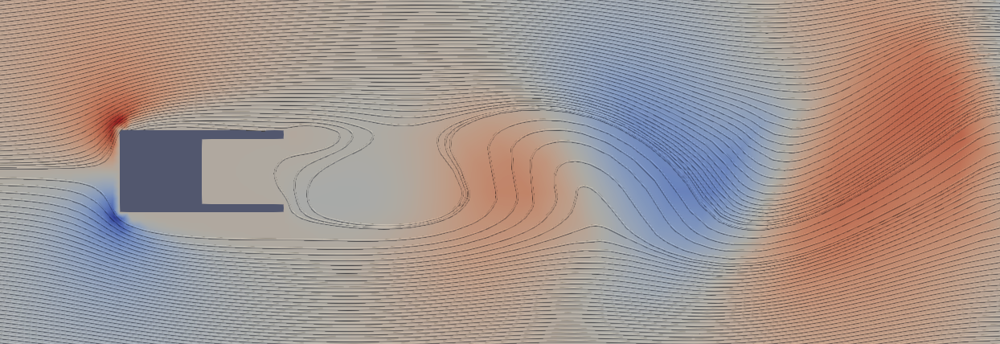

# DELAC - DEep Learning Aerodynamic Control


This project explores the application of Deep Reinforcement Learning (DRL) techniques to control and optimise the flow 
patterns around a 2D square cylinder, an iconic problem in fluid dynamics and aerodynamics. 



State-of-the-art DRL algorithms are leveraged to develop an intelligent control system that adapts and optimises the 
flow characteristics in real time. 
The DRL agent learns to make decisions regarding the control inputs (i.e., pressure measurements) by reducing the drag produced.

The project's methodology involves creating a realistic and high-fidelity simulation environment using Computational 
Fluid Dynamics (CFD) techniques. 
The DRL agent interacts with this environment, continuously learning and adapting its control policies through 
reinforcement learning. 

## Installation


To install the required packages run:

```
conda env create -f env.yml
conda activate delac
conda -c conda-forge turtleFSI
```
Since some minor customisations have been developed in turtleFSI code, the user should find the 
working directory of turtleFSI (usually in a path like ``` .../anaconda3/envs/delac/lib/python3.11/site-packages/turtleFSI```)
and then copy and paste the following scripts (from the folder turtleFSI Scripts):
- ``` monolithic.py``` in ``` .../anaconda3/envs/delac/lib/python3.11/site-packages/turtleFSI```
- ``` __init__.py``` in ``` .../anaconda3/envs/delac/lib/python3.11/site-packages/turtleFSI/problems```


It's now possible to launch the `main.py` once the parameters have been set.